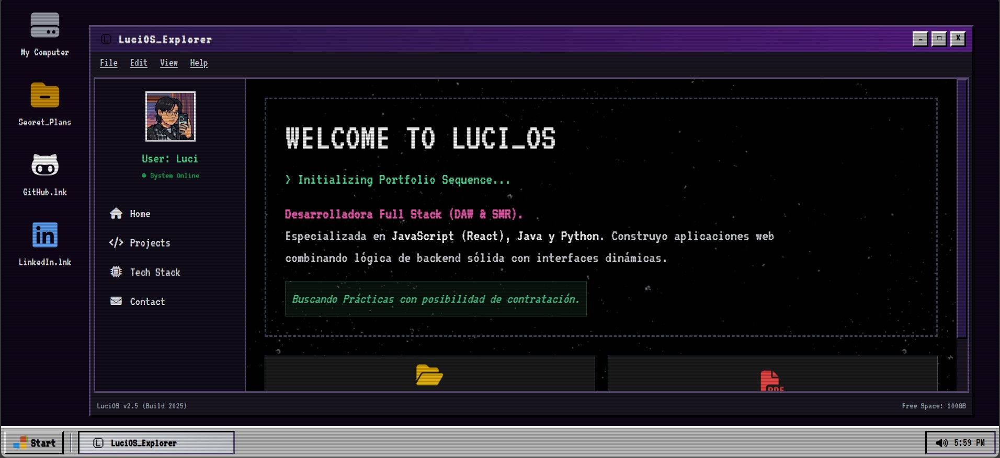

# 🖥️ LuciOS v2.5 Portfolio



> Un portafolio web interactivo con estética **Retro/Cyberpunk** (estilo Windows 95), construido con tecnologías modernas para un alto rendimiento y una experiencia de usuario única.


## ✨ Características

* **Interfaz Retro OS:** Diseño inspirado en sistemas operativos de los 90s con toques Cyberpunk.
* **Efectos CRT:** Scanlines, parpadeo de pantalla (flicker) y animaciones de arranque (boot sequence).
* **Diseño Responsive:** Adaptable a móviles, tablets (diseño híbrido) y escritorio (layout completo).
* **Sistema de Ventanas:** Navegación por pestañas simulando aplicaciones de escritorio.
* **Performance:** Carga ultrarrápida gracias a **Vite**.
* **Interactividad:** Reloj en tiempo real, menús desplegables y animaciones CSS avanzadas.

## 🛠️ Tecnologías Usadas


* **Core:** HTML5 Semántico y JavaScript (Vanilla ES6+).
* **Estilos:** Tailwind CSS v3 (con configuración personalizada de fuentes y colores).
* **Build Tool:** Vite.
* **Fuentes:** 'VT323' (Pixel Art) y 'Space Grotesk' (Google Fonts).
* **Iconos:** FontAwesome.

## 📂 Estructura del Proyecto

```bash
portfolio-luci/
├── public/                  # Archivos públicos estáticos
│   ├── img/                 # Imágenes del proyecto
│   ├── CV_Lucilene...pdf    # Tu currículum descargable
│   ├── favicon.png
│   └── vite.svg
├── src/                     # Código fuente
│   ├── main.js              # Lógica principal (Boot, Reloj, Tabs)
│   ├── style.css            # Importación de Tailwind y estilos custom
│   ├── counter.js           # (Opcional/Remanente de Vite)
│   └── javascript.svg
├── index.html               # Punto de entrada principal
├── tailwind.config.js       # Configuración de tema (Fuentes pixel, colores retro)
├── postcss.config.js        # Configuración de PostCSS para Tailwind
├── package.json             # Dependencias y scripts del proyecto
└── .gitignore               # Archivos ignorados por Git
````
## 🚀 Instalación y Uso Local

Si quieres clonar y ejecutar este proyecto en tu máquina local:

1. **Clonar el repositorio:**
   ```bash
   git clone [https://github.com/xni0/portfolio-luci.git](https://github.com/xni0/portfolio-luci.git)
   cd portfolio-luci
   ````
2. **Instalar dependencias:**
   ```bash
   npm install
   ````
3. **Iniciar servidor de desarrollo:**
   ```bash
   npm run dev
   ````
   La web estará disponible en http://localhost:5173 ó http://localhost:5174 lo más seguro

4. **Construir para producción:**
   ```bash
   npm run build
   ````
   Esto generará una carpeta dist/ optimizada y lista para subir a tu hosting.
## 🎨 Personalización

El proyecto está diseñado para ser fácilmente modificable:

* **Colores y Fuentes:** Revisa `tailwind.config.js` para modificar la paleta de colores `os-bg`, `win-bg`, `accent`, etc.
* **Contenido:** Todo el texto, enlaces a proyectos y estructura HTML se encuentran directamente en `index.html`.
* **Lógica:** La secuencia de arranque (`boot sequence`), el reloj y las funciones de ventana están en `src/main.js`.

## 🤝 Contribución

¡Las contribuciones son bienvenidas! Si tienes ideas para mejorar este sistema operativo web:

1. Haz un Fork del proyecto.
2. Crea una rama con tu nueva funcionalidad (`git checkout -b feature/AmazingFeature`).
3. Haz Commit de tus cambios (`git commit -m 'Add some AmazingFeature'`).
4. Haz Push a la rama (`git push origin feature/AmazingFeature`).
5. Abre un Pull Request.

## 📄 Licencia

Este proyecto está bajo la Licencia MIT - siéntete libre de usarlo como inspiración para tu propio portafolio.

<div align="center">
  <sub>Desarrollado con 💜 y 👾 por <a href="https://github.com/xni0">Luci</a></sub>
</div>
